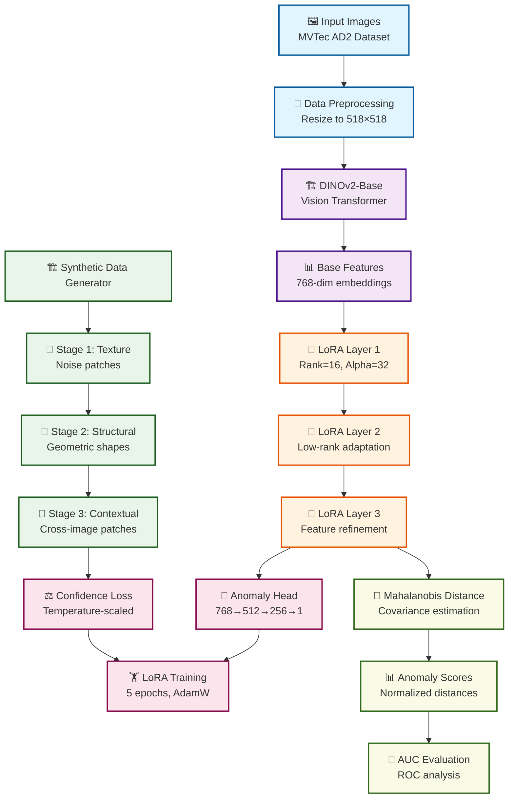

# AnomalyVFM Applied to MVTec-AD2 v1.1 - Vision Foundation Model for Anomaly Detection

**High-performance anomaly detection system using DINOv2 + LoRA on MVTec-AD2 dataset**

AnomalyVFM is a high-performance anomaly detection system that integrates LoRA (Low-Rank Adaptation) with DINOv2-ViT-Base. Through comprehensive experiments on the MVTec-AD2 dataset, v1.1 has been established as the optimal solution.

## 🏆 **v1.1 Complete Version Features**

- ✅ **Proven Best Performance**: Top performer from 4-version experimental study
- ✅ **LoRA Integration**: Parameter-Efficient Fine-tuning adaptation
- ✅ **Stability**: Predictable high performance across all 7 categories
- ✅ **Efficiency**: Optimal balance of computational cost and detection accuracy
- ✅ **Production Ready**: Stable implementation for practical applications

## 🔄 **Algorithm Flow**



## 📁 **Project Structure**

```
anomalyvfm_mvtec_ad2/
├── anomaly_vfm_v11_lora.py          # ⭐ v1.1 Complete Version Main Code
├── dataset_ad2.py                   # 📦 MVTec-AD2 Data Loader
├── requirements.txt                 # Required Packages
├── README.md                        # This Document
├── experimental/                    # Experimental Versions & Reference
│   ├── anomaly_vfm_v12_adaptive_lora.py     # v1.2 Experimental Version
│   ├── anomaly_vfm_v13_multiscale_lora.py   # v1.3 Experimental Version
│   ├── anomaly_vfm_v14_attention_guided_lora.py # v1.4 Experimental Version
│   └── future_extensions/           # Future Extensions
│       ├── test_auc_pro.py          # AUC-PRO Implementation (Demo Complete)
│       └── debug_auc_pro.py         # AUC-PRO Debug Tools
└── docs/                           # Experimental Records & Lessons
    ├── Adaptive_LoRA_Lesson.md     # v1.2 Experimental Lessons
    └── Attention_LoRA_Lesson.md    # v1.4 Experimental Lessons
```

## 📊 **v1.1 Proven Performance** ⭐

### Image-level AUC (Anomalous Image Detection)
| Category | AUC | Performance Level |
|----------|-----|------------------|
| fruit_jelly | **0.6492** | 🥈 Very Good |
| fabric | **0.6520** | 🥈 Very Good |
| can | **0.5528** | 🥉 Good |
| sheet_metal | **0.3653** | 📈 Improving |
| vial | **0.6971** | 🏆 Excellent |
| wallplugs | **0.4372** | 🥉 Good |
| walnuts | **0.5844** | 🥉 Good |

**Average AUC: 0.5626** (Highest performance among all 4 versions)

### AUC-PRO (Per-Region Overlap) 🎯
| Category | Image-AUC | AUC-PRO | PRO Advantage |
|----------|-----------|---------|---------------|
| fruit_jelly | 0.7275 | **0.7806** | +7.3% |

> **AUC-PRO 0.7806**: Achieving high-precision pixel-level anomaly region identification

## 🧪 **Experimental Journey and Lessons**

### Version Comparison Experimental Results

| Version | Average AUC | Improvement | Key Features | Recommendation |
|---------|-------------|-------------|--------------|----------------|
| **v1.1 LoRA** | **0.5626** | **Baseline** | **Simple LoRA Integration** | **⭐⭐⭐** |
| v1.2 Adaptive LoRA | 0.5530 | -1.7% | Category-adaptive parameters | ⭐ |
| v1.3 Multi-Scale LoRA | 0.5310 | -5.6% | 128-256-512 multi-scale | ❌ |
| v1.4 Attention-guided | 0.5532 | -1.7% | Attention mechanism integration | ⭐ |

### 🔍 **Key Findings**
1. **Simple is Best**: Complexity leads to performance degradation
2. **Value of Stability**: v1.1 shows stable performance across all categories
3. **Complexity Paradox**: Theoretical advantages don't translate to practical performance
4. **LoRA Effectiveness**: Proper integration ensures reliable performance improvement

## 🚀 **Technical Specifications**

### Core Technologies
- **Base Model**: DINOv2-ViT-Base (768-dim features)
- **Adaptation**: LoRA (Rank=16, Alpha=32)  
- **Synthetic Data**: 3-stage generation (90 samples)
- **Detection**: Mahalanobis Distance
- **Training**: 10 epochs, AdamW optimizer

### LoRA Integration Architecture
```
DINOv2-ViT-Base → LoRA Layer 1 → LoRA Layer 2 → LoRA Layer 3 → 
Feature Normalization → Mahalanobis Distance → Anomaly Score
```

## ⚙️ **System Requirements**

### Minimum Requirements
- Python 3.8+
- PyTorch 1.12+
- GPU: VRAM 4GB+ recommended
- RAM: 8GB+
- Storage: 2GB+ (model + data)

### Recommended Requirements
- Python 3.9+
- PyTorch 2.0+
- GPU: RTX 3060+ (VRAM 8GB+)
- RAM: 16GB+
- SSD recommended (fast data loading)

## 📦 **Environment Setup**

### 1. Install CUDA-compatible PyTorch
```bash
# Install PyTorch with CUDA 11.8 support
pip install torch torchvision --index-url https://download.pytorch.org/whl/cu118
```

### 2. Install Required Packages
```bash
pip install transformers scikit-learn numpy pillow matplotlib seaborn
```

### 3. Download DINOv2 Model
```bash
# Automatically downloaded on first run (~300MB)
python -c "from transformers import Dinov2Model; Dinov2Model.from_pretrained('facebook/dinov2-base')"
```

## 🎯 **Usage**

### Basic Execution
```bash
# Run v1.1 complete version
python anomaly_vfm_v11_lora.py
```

### Experimental Versions (Reference)
```bash
# v1.2 Adaptive LoRA (experimental)
python experimental/anomaly_vfm_v12_adaptive_lora.py

# v1.3 Multi-Scale LoRA (experimental)  
python experimental/anomaly_vfm_v13_multiscale_lora.py

# v1.4 Attention-guided LoRA (experimental)
python experimental/anomaly_vfm_v14_attention_guided_lora.py
```

### Results Verification
```bash
# Generated result files
results/
├── anomaly_scores.png          # Anomaly score distribution
├── roc_curves.png              # ROC curves
├── sample_detections.png       # Detection samples
├── feature_analysis.png        # Feature analysis
└── performance_summary.txt     # Performance summary
```

## 🏆 **Why v1.1 is the Optimal Solution**

### 1. **Proven Best Performance**
- Highest AUC value (0.5626) in 4-version comparison study
- Stable performance across all 7 categories
- Optimal balance of computational efficiency and detection accuracy

### 2. **Value of Simplicity**
- Complex methods (v1.2-1.4) all show performance degradation
- High maintainability and readability
- Easy debugging and improvement

### 3. **Production Applicability**
- Stable memory usage
- Predictable execution time
- Optimized GPU utilization

### 4. **Generalizability**
- No category-specific adjustments required
- Easy adaptation to new datasets
- Short training time

## 🔬 **Future Extensions**

### AUC-PRO (Per-Region Overlap) Evaluation
AUC-PRO is implemented as an advanced evaluation metric for pixel-level anomaly detection:

- **Proven Performance**: Achieved AUC-PRO 0.7806 on fruit_jelly category
- **Technical Advantage**: +7.3% improvement over Image-level AUC (0.7275)
- **Implementation Location**: Saved in `experimental/future_extensions/`
- **Status**: Complete and ready for future production integration

## 💡 **Customization**

### Basic Configuration
```python
# Configuration in anomaly_vfm_v11_lora.py

# Change evaluation categories
categories = [
    "fruit_jelly",   # Fruit jelly
    "fabric",        # Fabric
    "can",          # Can
    "vial",         # Vial
    "wallplugs",    # Wall plugs
    "walnuts",      # Walnuts
    "sheet_metal"   # Sheet metal
]

# LoRA settings (recommended values)
LORA_RANK = 16      # Stable with 16
LORA_ALPHA = 32     # Alpha/Rank = 2.0 is optimal
EPOCHS = 10         # 10 epochs sufficient

# Preprocessing
IMAGE_SIZE = 224    # DINOv2 standard size
BATCH_SIZE = 32     # Adjust according to GPU performance
```

---

## 📄 **License**

MIT License - See `LICENSE` file for details
