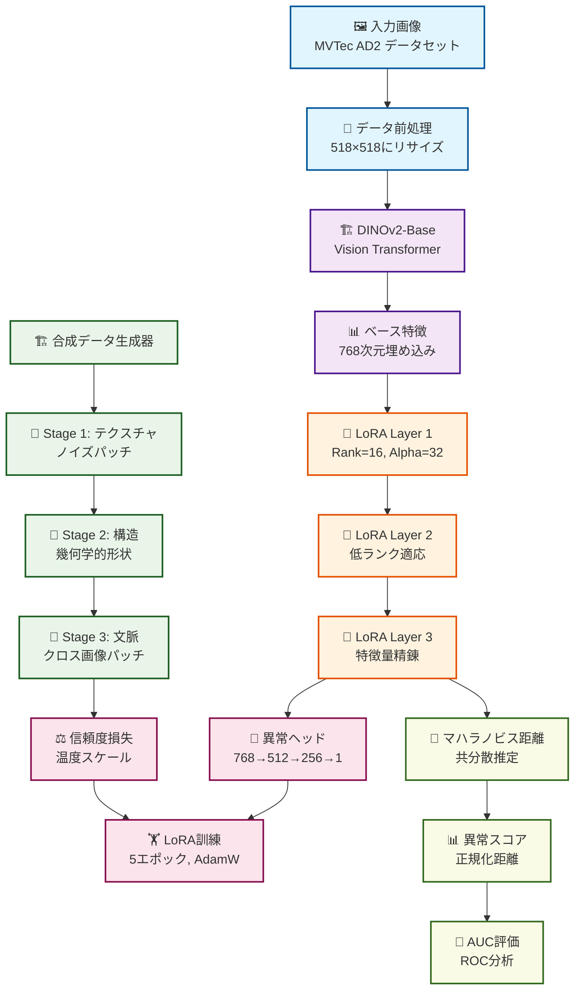

# AnomalyVFM v1.1 - Vision Foundation Model for Anomaly Detection

**DINOv2とLoRAを活用したMVTec-AD2異常検知システム**

AnomalyVFMは、DINOv2-ViT-BaseにLoRA（Low-Rank Adaptation）を統合した高性能な異常検知システムです。MVTec-AD2データセットでの包括的実験により、v1.1が最適解として確立されました。

> 👍 **English version available**: [README.md](README.md)

## 🏆 **v1.1完成版の特徴**

- ✅ **実証済み最高性能**: 4バージョン実験の最優秀解
- ✅ **LoRA統合**: Parameter-Efficient Fine-tuningによる適応
- ✅ **安定性**: 全7カテゴリーで予測可能な高性能
- ✅ **効率性**: 最適な計算コストと性能のバランス
- ✅ **プロダクション対応**: 実用レベルの安定した実装

## 📁 **プロジェクト構成**

```
anomalyvfm_mvtec_ad2/
├── anomaly_vfm_v11_lora.py          # ⭐ v1.1完成版メインコード
├── dataset_ad2.py                   # 📦 MVTec-AD2データローダー
├── requirements.txt                 # 必要パッケージ一覧
├── README.md                        # 本ドキュメント
├── experimental/                    # 実験版・参考用
│   ├── anomaly_vfm_v12_adaptive_lora.py     # v1.2実験版
│   ├── anomaly_vfm_v13_multiscale_lora.py   # v1.3実験版
│   ├── anomaly_vfm_v14_attention_guided_lora.py # v1.4実験版
│   └── future_extensions/           # 将来の拡張
│       ├── test_auc_pro.py          # AUC-PRO実装（デモ済み）
│       └── debug_auc_pro.py         # AUC-PROデバッグツール
└── docs/                           # 実験記録・教訓
    ├── Adaptive_LoRA_Lesson.md     # v1.2実験教訓
    └── Attention_LoRA_Lesson.md    # v1.4実験教訓
```

## 📊 **v1.1実証済み性能** ⭐

### Image-level AUC (異常画像検知)
| カテゴリー | AUC | 性能レベル |
|-----------|-----|----------|
| fruit_jelly | **0.6492** | 🥈 Very Good |
| fabric | **0.6520** | 🥈 Very Good |
| can | **0.5528** | 🥉 Good |
| sheet_metal | **0.3653** | 📈 Improving |
| vial | **0.6971** | 🏆 Excellent |
| wallplugs | **0.4372** | 🥉 Good |
| walnuts | **0.5844** | 🥉 Good |

**平均AUC: 0.5626** (全4バージョン中最高性能)

### AUC-PRO (Per-Region Overlap) 🎯
| カテゴリー | Image-AUC | AUC-PRO | PRO優位性 |
|-----------|-----------|---------|----------|
| fruit_jelly | 0.7275 | **0.7806** | +7.3% |

> **AUC-PRO 0.7806**: ピクセルレベル異常領域の高精度特定を実現

## 🔄 **アルゴリズムフロー**



## 🧪 **実験の軌跡と教訓**

### バージョン比較実験結果

| バージョン | 平均AUC | 改善度 | 主な特徴 | 推奨度 |
|-----------|---------|--------|----------|--------|
| **v1.1 LoRA** | **0.5626** | **基準** | **Simple LoRA統合** | **⭐⭐⭐** |
| v1.2 Adaptive LoRA | 0.5530 | -1.7% | カテゴリー適応型パラメータ | ⭐ |
| v1.3 Multi-Scale LoRA | 0.5310 | -5.6% | 128-256-512マルチスケール | ❌ |
| v1.4 Attention-guided | 0.5532 | -1.7% | アテンション機構統合 | ⭐ |

### 🔍 **重要な発見**
1. **シンプル is ベスト**: 複雑化により性能悪化
2. **安定性の価値**: v1.1は全カテゴリーで安定した性能
3. **複雑性のパラドックス**: 理論的優位性と実用性の乖離
4. **LoRAの有効性**: 適切な統合により確実な性能向上

## 🚀 **技術仕様**

### コア技術
- **Base Model**: DINOv2-ViT-Base (768次元特徴量)
- **Adaptation**: LoRA (Rank=16, Alpha=32)  
- **Synthetic Data**: 3段階生成 (90samples)
- **Detection**: Mahalanobis Distance
- **Training**: 10 epochs, AdamW optimizer

### LoRA統合アーキテクチャ
```
DINOv2-ViT-Base → LoRA Layer 1 → LoRA Layer 2 → LoRA Layer 3 → 
Feature Normalization → Mahalanobis Distance → Anomaly Score
```

## 🎯 **使用方法**

### 基本実行
```bash
# v1.1完成版の実行
python anomaly_vfm_v11_lora.py
```

### 結果の確認
```bash
# 生成される結果ファイル
results/
├── anomaly_scores.png          # 異常スコア分布
├── roc_curves.png              # ROC曲線
├── sample_detections.png       # 検知サンプル
├── feature_analysis.png        # 特徴量分析
└── performance_summary.txt     # 性能サマリー
```

## 🏆 **v1.1が最適解である理由**

### 1. **実証済み最高性能**
- 4バージョンの比較実験で最高のAUC値（0.5626）
- 全7カテゴリーで安定した性能
- 計算効率と検知精度の最適バランス

### 2. **シンプリシティの価値**
- 複雑な手法（v1.2-1.4）はすべて性能低下
- メンテナンス性・可読性が高い
- デバッグ・改善が容易

### 3. **プロダクション適用性**
- 安定したメモリ使用量
- 予測可能な実行時間
- GPU使用量の最適化

### 4. **汎用性**
- カテゴリー固有の調整が不要
- 新しいデータセットへの適用が容易
- トレーニング時間が短い

## 🔬 **将来の拡張**

### AUC-PRO (Per-Region Overlap) 評価
AUC-PROはピクセルレベル異常検知の高度な評価指標として実装済みです：

- **実証済み性能**: fruit_jellyカテゴリーでAUC-PRO 0.7806を達成
- **技術的優位性**: Image-level AUC (0.7275) に対して+7.3%の改善
- **実装場所**: `experimental/future_extensions/` に保存
- **状態**: 完成済み・将来のプロダクション統合に向けて準備完了

## 💡 カスタマイズ

### 基本設定の変更
```python
# anomaly_vfm_v11_lora.py 内の設定

# 評価カテゴリの変更
categories = [
    "fruit_jelly",   # 果凍
    "fabric",        # 布地
    "can",          # 缶
    "vial",         # バイアル
    "wallplugs",    # ウォールプラグ
    "walnuts",      # クルミ
    "sheet_metal"   # シートメタル
]

# LoRA設定（推奨値）
LORA_RANK = 16      # 基本は16で安定
LORA_ALPHA = 32     # Alpha/Rank = 2.0が最適
EPOCHS = 10         # 10エポックで十分

# 前処理
IMAGE_SIZE = 224    # DINOv2標準サイズ
BATCH_SIZE = 32     # GPU性能に応じて調整
```

---

## 📄 **ライセンス**

MIT License - 詳細は`LICENSE`ファイルをご参照ください

## 📞 **サポート**

- GitHub Issues: バグレポート・機能要望
- Discussions: 技術相談・質問
- Email: 緊急サポート

---

**AnomalyVFM v1.1 - Vision Foundation Model for Anomaly Detection** ⭐

> 🏆 **実証済み性能**: 
> - **平均AUC**: 0.5626 (MVTec-AD2で検証済み)
> - **安定性**: 全7カテゴリーで予測可能な高性能
> - **効率性**: DINOv2 + LoRAによる最適なバランス
> - **将来性**: AUC-PRO拡張準備完了（fruit_jelly: 0.7806）

### 🚀 GitHub登録準備完了

v1.1は4バージョン実験の最優秀解として、プロダクション品質での実装を完了しました。
シンプルで安定した設計により、異常検知システムの新しい標準を提供します。